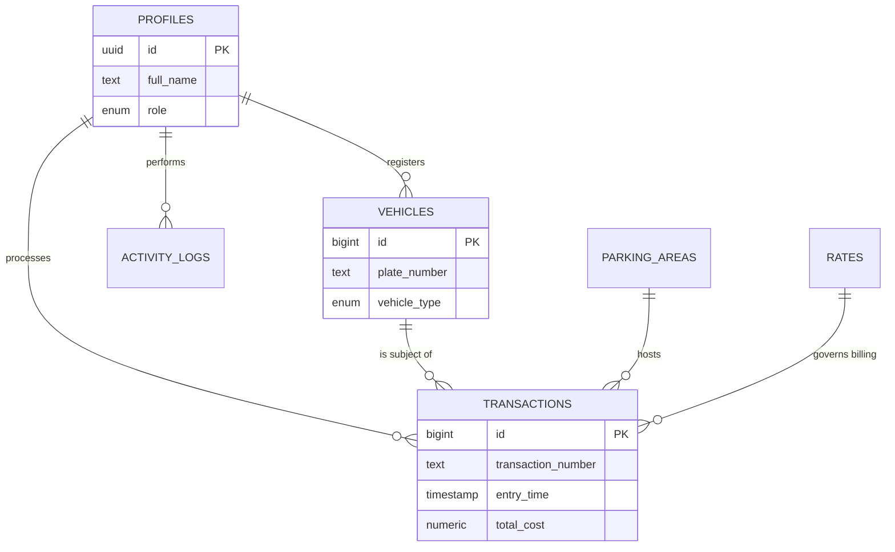

# System Architecture

Zlot is designed as a high-performance Parking Management System built on the **Next.js 16** App Router and the **Supabase** ecosystem. It follows a modular, type-safe architecture.

## Tech Stack

- **Framework**: [Next.js 16 (App Router)](https://nextjs.org/)
- **Database**: [PostgreSQL](https://www.postgresql.org/)
- **ORM**: [Drizzle ORM](https://orm.drizzle.team/)
- **Auth & Storage**: [Supabase](https://supabase.com/)
- **State Management**: [Nuqs](https://nuqs.47ng.com/) (URL-based) & [TanStack Query](https://tanstack.com/query)
- **UI & Styling**: [Tailwind CSS v4](https://tailwindcss.com/), [Shadcn/UI](https://ui.shadcn.com/), [Framer Motion](https://www.framer.com/motion/)
- **Icons**: [Phosphor Icons](https://phosphoricons.com/)

## Directory Structure

The project has been reorganized into a centralized `src` directory for better maintainability:

```text
src/
├── actions/        # Server Actions (Business logic, DB mutations)
├── app/            # Next.js App Router (Pages, Layouts, API routes)
├── components/     # Shared UI components (Atomic design)
├── db/             # Drizzle Schema, Migrations, and Validations
│   ├── schema/     # Table definitions
│   └── validations/# Zod schemas for runtime validation
├── lib/            # Utility functions, Supabase clients, Auth guards
└── proxy.ts        # Supabase Session Middleware
```

## ERD Schema & Relations

The Zlot database is architected for maximum relational integrity and high-speed telemetry. Below is the detailed breakdown of the entity relationships and data columns.

### Detailed Table Schemas

#### 1. `profiles`

_Core identity table linking to Supabase Auth._

- `id` (UUID, PK): Unique identifier linked to `auth.users`.
- `full_name` (Text): The operator's display name.
- `role` (Enum): `admin`, `employee`, or `owner`.
- `is_active` (Boolean): Operational status toggle.
- `created_at` / `updated_at` (Timestamp TZ).
- `deleted_at` (Timestamp TZ): Support for soft-delete.

#### 2. `vehicles`

_Central registry for all units entering the facility._

- `id` (BigInt, PK): Auto-incrementing identity.
- `plate_number` (Text, Unique): Primary search index.
- `vehicle_type` (Enum): `motorcycle`, `car`, or `other`.
- `color` / `owner_name` (Text, Optional).
- `profile_id` (UUID, FK): References the operator who registered the vehicle.
- `created_at` / `updated_at` (Timestamp TZ).

#### 3. `transactions`

_The "Engine" table capturing all operational events._

- `id` (BigInt, PK): Auto-incrementing identity.
- `transaction_number` (Text, Unique): Protocol reference.
- `vehicle_id` (BigInt, FK): References the specific vehicle.
- `area_id` (BigInt, FK): References the assigned parking zone.
- `rate_id` (BigInt, FK): References the billing rate active at entry.
- `profile_id` (UUID, FK): References the employee on duty.
- `entry_time` (Timestamp TZ): Mandatory event start.
- `exit_time` (Timestamp TZ): Nullable until settlement.
- `status` (Enum): `entered` or `exited`.
- `total_cost` (Numeric): Calculated fee upon settlement.
- `payment_method` (Enum): `QRIS` or `CASH`.

#### 4. `parking_areas`

_Infrastructure telemetry._

- `id` (BigInt, PK).
- `area_name` (Text): e.g., "Zone Alpha", "Basement 1".
- `capacity` (Integer): Total slots available.
- `occupied` (Integer): Real-time occupancy counter.

#### 5. `rates`

_Financial logic engine._

- `id` (BigInt, PK).
- `vehicle_type` (Enum, Unique): One rate profile per type.
- `hourly_rate` (Numeric): Cost per hour of occupancy.

#### 6. `activity_logs`

_Audit trail for all system operations._

- `id` (BigInt, PK).
- `profile_id` (UUID, FK): References the operator performing the action.
- `action` (Text): Description of the action.
- `details` (JSONB): Additional information about the action.
- `created_at` (Timestamp TZ).

### Entity Relationship Diagram (ERD)



### Protocol Logic

1. **Entry Injection**: A `transaction` is created, linking a `vehicle` to a `parking_area` and a `rate`. The `parking_area.occupied` count is incremented.
2. **Settlement**: Upon `exit_time` update, the system computes the duration, pulls the `hourly_rate` from the linked `rate` object, and generates the `total_cost`.
3. **Telemetry**: Dashboard occupancy rates are derived by comparing `parking_area.occupied` against `parking_area.capacity`.

## Core Design Patterns

### 1. Centralized Server Actions

All database interactions are encapsulated in Server Actions within `src/actions`. This ensures that business logic is separated from the UI and remains highly reusable.

### 2. URL as State (Nuqs)

Dashboard filters, search queries, and pagination are synchronized with the URL using `nuqs`. This allows for deep-linking and a "browser-native" feel where state persists across refreshes.

### 3. Industrial-Premium UI

The design system (Industrial-Eco) uses high-contrast typography, subtle micro-interactions (Framer Motion), and a layout designed for high-density information display.

### 4. Hybrid Rendering

- **Server Components (RSC)**: Used for data fetching to reduce client-side bundle size.
- **Client Components**: Used for interactive table states, charts (Recharts), and real-time form handling (TanStack Form).

## Data Flow

1. **Request**: User interacts with a Client Component (e.g., Entry Form).
2. **Action**: Component invokes a Server Action (e.g., `logEntry`).
3. **Validation**: Action validates input using Zod.
4. **Database**: Transaction is executed via Drizzle ORM.
5. **Revalidation**: `revalidatePath` updates the Next.js cache, pushing new state to the UI.
